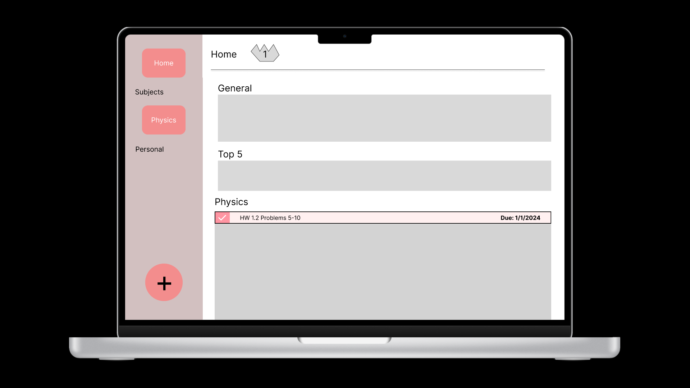

# Taskify

Taskify is a project management tool designed to help teams organize tasks efficiently.

## Table of Contents

-   [How to Contribute](#how-to-contribute)
-   [Coding Standards](#coding-standards)
-   [Auth Sequence Diagram](#auth-sequence-diagram)
-   [Figma Prototype](#figma-prototype)

## How to Contribute

Contributions are welcome! Follow these steps to contribute to the project:

1. **Fork the repository** and clone it to your local machine.
2. **Create a new branch** for your changes: `git checkout -b my-feature`.
3. **Make your changes** and test them thoroughly.
4. **Commit your changes**: `git commit -am 'Add some feature'`.
5. **Push to the branch**: `git push origin my-feature`.
6. **Submit a pull request**.

## Coding Standards

In this project, we adhere to the following coding standards to ensure consistency and maintainability:

### Language Guidelines

#### JavaScript/Node.js Naming Conventions:

-   Use camelCase for variable and function names.
-   Use PascalCase for React components.
-   Use UPPERCASE with \_ (underscore) for constants.
-   Keep variable names concise but descriptive. Include units within the name if necessary.

#### JavaScript/Node.js Best Practices:

-   Prefer `const` and `let` over `var`.
-   Use arrow functions (`() => {}`) for inline functions and callbacks.
-   Use destructuring for object and array assignments where applicable.
-   Use ES6 features like template literals, spread/rest operators, and default parameters where appropriate.
-   Handle errors properly using try/catch or promise rejections.
-   Only import necessary/used modules.
-   Validate prop types for React componenents.

### Code Structure

#### Component Structure:

-   Follow the principles of component-driven architecture.
-   Keep components small, focused, and reusable.
-   Separate presentational components from container components.

### Project Structure

-   Separate concerns by using modules and following the principles of clean architecture.
-   Keep file names concise. Follow naming conventions for each separate folder.

### Dependency Management

-   Use npm or Yarn to manage project dependencies.
-   Pin dependencies to specific versions in `package.json` to ensure consistent behavior across environments.
-   Regularly update dependencies to leverage security fixes and new features.

### Error Handling

#### Error Logging:

-   Log errors with contextual information for easier debugging.
-   Implement error boundaries to catch and handle errors gracefully in React applications.

### Security

#### Security Best Practices:

-   Sanitize user inputs to prevent injection attacks (e.g., SQL injection, XSS).
-   Implement proper authentication and authorization mechanisms.

### Documentation

#### Code Comments:

-   Use comments to explain complex algorithms, business logic, or tricky code segments.
-   Follow a consistent style and formatting for comments throughout the codebase.
-   Avoid unnecessary or redundant comments that don't provide valuable insights.

### Version Control

#### Git:

-   Commit messages should be descriptive.
-   Branch names should be concise and descriptive of the feature or fix they represent.
-   Require code reviews for all pull requests before merging.
-   Utilize Git hooks for automating tasks like linting, formatting, or running tests before commits or pushes.
-   Consider squashing related commits into a single commit before merging feature branches into the main branch. This helps keep the commit history clean and concise.

### Continuous Integration/Continuous Deployment (CI/CD)

#### CI/CD Pipeline:

-   Automate testing, building, and deployment processes using GitHub Actions.
-   Include linting, code analysis, and security checks in the CI pipeline for early detection of issues.

### Code Reviews

-   Conduct code reviews for all changes before merging.
-   Provide constructive feedback and suggestions for improvement.
-   Ensure adherence to coding standards and best practices.

By following these coding standards, we aim to maintain a high level of code quality and readability throughout the project.

## Auth Sequence Diagram

## Figma Prototype

Taskify's UI design is prototyped in Figma. Click the image below to view the prototype:

